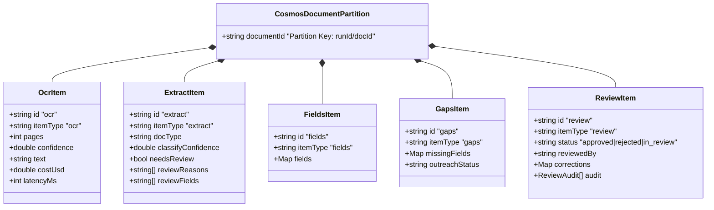

# PACCA Vision: Complete End-to-End System Architecture & Technical Insights

> **Purpose of this Document**  
> This guide is an exhaustive, start-to-finish technical breakdown of the entire **PACCA Vision** Intelligent Document Processing (IDP) platform. It demystifies the backend architecture, data models, Azure cloud integrations, and business logic, providing clear insights into how every backend function operates and how the React frontend interfaces with each layer.

---

## 1. Executive Summary & Big-Picture Architecture

PACCA Vision is a specialized Healthcare Intake & Prior Authorization (PA) Intelligent Document Processing platform. It ingests complex medical faxes, clinical notes, referral forms, and payer denial letters, transforms unstructured document pages into structured clinical entities, detects data gaps, orchestrates human-in-the-loop (HIL) reviews, and initiates automated Interactive Voice Response (IVR) patient outreach.

```mermaid
flowchart TD
    subgraph Frontend ["Frontend (React 19 + Vite)"]
        UI_Upload["UploadPanel (Direct Blob Upload)"]
        UI_Docs["DocumentsLive (Real-time Grid)"]
        UI_Detail["DocumentDetailLive (PDF + Extracted Fields)"]
        UI_HIL["HilLive (Review & Correction Workbench)"]
        UI_IVR["IvrOutreachButton (Phone Outreach)"]
        UI_Sol["SolutionsV2 (Schema & Analyzer Studio)"]
    end

    subgraph NodeBackend ["Node.js / Express Serverless Layer"]
        API_Route["/api/senderra/* (server/senderra/api.ts)"]
        API_Sol["/api/solutions-v2 (server/solutionsV2Api.ts)"]
        MOD_Blob["blob.ts (SAS Token Generator)"]
        MOD_Cosmos["cosmos.ts (Query & Projection Engine)"]
        MOD_IVR["ivr.ts (Outreach Dispatcher & Webhook)"]
        MOD_FileShare["azureFileShare.ts (Asset Uploader)"]
        MOD_Schema["schemaLoader.ts (Runtime Schema Fetcher)"]
    end

    subgraph AzureCloud ["Azure Cloud Infrastructure"]
        BlobIn["Azure Blob Storage (docs-in)"]
        FileShare["Azure File Share (assets/)"]
        FuncApp["Azure Function App (Flex Consumption)"]
        CosmosDB["Azure Cosmos DB (senderra-idp / documents)"]
        CU_AI["Azure AI Content Understanding / Layout"]
        AOAI["Azure OpenAI (gpt-4o-mini / gpt-5.4-mini)"]
        IVR_Platform["External IVR Phone Outreach Platform"]
    end

    UI_Upload -->|1. Request SAS| API_Route
    API_Route --> MOD_Blob
    MOD_Blob -->|Mint SAS| UI_Upload
    UI_Upload -->|2. Direct Binary PUT| BlobIn

    BlobIn -->|Event Grid Trigger| FuncApp
    FuncApp -->|Stage 1: OCR| CU_AI
    FuncApp -->|Stage 2: Extraction| AOAI
    FuncApp -->|Stage 3: Save State| CosmosDB

    UI_Docs -->|Poll GET /documents| API_Route
    UI_Detail -->|GET /document?id=...| API_Route
    API_Route --> MOD_Cosmos
    MOD_Cosmos -->|Point-reads & Projections| CosmosDB

    UI_HIL -->|POST /review (Approve/Reject/Edit)| API_Route
    API_Route -->|Upsert 'review' item| CosmosDB

    UI_IVR -->|POST /ivr-trigger| API_Route
    API_Route --> MOD_IVR
    MOD_IVR -->|Dispatch Outreach| IVR_Platform
    IVR_Platform -->|Webhook POST /ivr-writeback| API_Route
    API_Route -->|Auto-settle Review| CosmosDB

    UI_Sol -->|POST/DELETE /api/solutions-v2| API_Sol
    API_Sol -->|Update Analyzers & Schemas| FileShare
```

---

## 2. Azure Storage & Database Data Models

### 2.1 Azure Cosmos DB: The Single-Partition Document Model
* **Database**: `senderra-idp`
* **Container**: `documents`
* **Partition Key**: `/documentId` (e.g. `ui/referralForm_2026_09_21` or `prod/rx_001`)

#### Why One Partition Per Document?
In Cosmos DB, querying within a single partition key is a **1 Request Unit (RU)** point read. Because a reviewer or document detail view accesses all information for a specific document simultaneously, grouping all items under the identical `documentId` partition key guarantees high performance.

Inside the container, **each document is not a single large JSON blob**. It is composed of up to **5 distinct item records**, differentiated by `itemType`:

| Item Type (`itemType`) | Created By | Description & Contents |
| :--- | :--- | :--- |
| **`ocr`** | Azure Function (`fn_ocr`) | Raw text extracted from Azure AI Content Understanding. Stores total page count (`pages`), latency (`latencyMs`), OCR cost (`costUsd`), full markdown text, and per-page confidence scores (`minPageConfidence`). |
| **`extract`** | Azure Function (`fn_extract`) | Classification and summary metadata. Stores detected `docType` (e.g., `referralForm`, `clinicalNote`), `classifyConfidence`, list of `reviewReasons`, `reviewFields`, and total field count. |
| **`fields`** | Azure Function (`fn_extract`) | Complete field dictionary (`Record<string, ExtractedField>`). Includes extracted value, exact text quote, bounding polygon coordinates, OCR match score, and field-level confidence signals. |
| **`gaps`** | Azure Function (`fn_gaps`) | Missing required fields (Class-A gaps like missing DOB, Patient Phone, NPI). Stores outreach hints and IVR call eligibility. |
| **`review`** | Node API (`handleReview` / `handleIvrWriteback`) | Human-in-the-Loop review status (`approved`, `rejected`, `in_review`), reviewer username, timestamps, field corrections dictionary, and full immutable audit trail. |



### 2.2 Azure Blob Storage: Ingestion & SAS Token Architecture
* **Account**: `senderraidpsa`
* **Container**: `docs-in`
* **Run ID Prefix**: `ui/` for manual uploads, `prod/` for production pipeline traffic.

#### Secure Upload Strategy
1. The frontend never sends PDF binary files through the Node.js serverless backend. Doing so would exceed serverless payload limits (typically 4.5 MB on Vercel) and consume compute memory.
2. Instead, the frontend calls `POST /api/senderra/upload-sas`.
3. The server generates a **Shared Access Signature (SAS) token** restricted to that exact blob path with **Write-only permissions** valid for **15 minutes**.
4. The browser uploads the PDF file directly to Azure Blob Storage using `PUT https://senderraidpsa.blob.core.windows.net/docs-in/ui/...`.
5. The moment the binary write completes, **Azure Event Grid** triggers the Flex Consumption Function App, starting Stage 1 without any web server polling.

---

## 3. Deep Dive: Backend Code Modules & Logic

All backend serverless code is located in `server/`.

### 3.1 `server/senderra/config.ts`
* **Purpose**: Centralized environment variable reader and validator.
* **Logic**:
  * Enforces that no server secrets (`COSMOS_KEY`, `AZURE_STORAGE_KEY`, `IVR_API_KEY`) are ever prefixed with `VITE_` (preventing Vite from bundling them into public browser code).
  * Validates that `COSMOS_ENDPOINT` starts with `https://`.
  * Returns typed configuration or a structured error object with missing keys.

### 3.2 `server/senderra/cosmos.ts`
* **Purpose**: Primary database interface for Cosmos DB.
* **Key Functions**:
  * **`container()`**: Initializes `@azure/cosmos` lazily within request scope. Reuses a single client connection across warm lambda invocations.
  * **`fetchRecords(container)`**: Executes cross-partition query `SELECT * FROM c WHERE c.itemType IN ('ocr', 'extract', 'review', 'gaps')`. Note that `fields` items are deliberately excluded to keep query payloads under 2 MB.
  * **`foldDocumentItems(items)`**: Projects the separate Cosmos items (`ocr`, `extract`, `review`) into a unified `DocumentSummary` for the UI list.
  * **`readDocument(container, documentId)`**: Executes parallel point reads for the target document's `ocr`, `extract`, `fields`, `gaps`, and `review` items.
  * **`applyReviewAction(container, documentId, action)`**: Implements the review state machine:
    * Action `claim`: Assigns document to a reviewer (`claimed_by`).
    * Action `save`: Updates partial field corrections and writes an audit log entry.
    * Action `approve`: Marks status as `approved`, sets `reviewed_by` and `reviewed_at`.
    * Action `reject`: Marks status as `rejected` with explanation notes.

### 3.3 `server/senderra/blob.ts`
* **Purpose**: Azure Blob Storage SAS generation and pending intake scanner.
* **Key Functions**:
  * **`mintUploadSas(config, runId, docId)`**: Computes an HMAC-SHA256 signature using `StorageSharedKeyCredential` with permissions `racw` (read, add, create, write) expiring in 15 minutes.
  * **`mintReadSas(config, documentId)`**: Generates a read-only token so the frontend PDF viewer can embed and stream the PDF securely without public access.
  * **`listRecentUploads(config, runId)`**: Lists blobs uploaded within the last 15 minutes that do not yet have an `ocr` item in Cosmos DB, folding them into the UI with a `"Queued"` status indicator.

### 3.4 `server/senderra/ivr.ts`
* **Purpose**: Automated phone outreach integration.
* **Key Functions**:
  * **`outreachHint(gapsItem, reviewItem)`**: Determines if a document has open required fields (e.g. missing DOB, policy ID) that can be asked over the phone to a patient.
  * **`trigger(config, payload)`**: Posts the gaps item to the external IVR dispatch URL (`IVR_TRIGGER_URL`) with header `x-api-key`.
  * **`syncIvrOutreach(container, config, documentId)`**: Polls IVR call status. When a patient answers questions on the phone, this function converts the spoken answers into field corrections signed with identity `"IVR Outreach"`.

### 3.5 `server/senderra/analytics.ts`
* **Purpose**: Real-time operational intelligence.
* **Key Functions**:
  * **`computeAnalytics(records)`**: Aggregates throughput, straight-through processing (STP) rate (percentage of documents passing without human review), average confidence, field error rates, and estimated cost per page across document types.

### 3.6 `server/solutionsV2Api.ts`
* **Purpose**: Solutions Studio engine for dynamic document type definitions.
* **Key Functions**:
  * **`getCatalog()`**: Reads `analyzers/out/field_meta.json` and formats active document schemas, required fields, and guidance rules.
  * **`saveDocumentType(body)`**: Multi-step LLM compilation process:
    1. Loads prompt templates from `server/prompts/solutions-v2/`.
    2. Calls Azure OpenAI / OpenAI to generate strict JSON schemas (`schemas/<type>.json`) and extraction prompts (`prompts/<type>.txt`).
    3. Updates `type_catalog.txt` and `field_meta.json`.
    4. Automatically updates `server/azureFileShare.ts` to push new assets into Azure File Share.
  * **`deleteDocumentType(body)`**:
    1. Parses `analyzers/senderra-analyzers.yaml` into an Abstract Syntax Tree (AST) using `yaml.parseDocument`.
    2. Removes the document type from `classification.categories` and `types`.
    3. Removes call flow definitions from `ivr_gap_routing.yaml`.
    4. Executes `python build_prompts.py` to recompile assets.
    5. Deletes corresponding assets from Azure File Share.

---

## 4. Frontend Layer & UI Integration

The frontend is built with **React 19, TypeScript, Tailwind CSS, and Radix UI** inside `client/src/`.

### 4.1 Frontend API Layer: `client/src/senderra/api.ts`
Custom React hooks manage data fetching, state caching, and live polling:

| Hook | Backing Endpoint | Functionality |
| :--- | :--- | :--- |
| **`useDocuments()`** | `GET /api/senderra/documents` | Polls the document table every 6 seconds. Automatically handles optimistic updates when documents change status. |
| **`useDocument(id)`** | `GET /api/senderra/document?id=...` | Loads full document details (OCR text, bounding boxes, field provenance, and read SAS URL). |
| **`useAnalytics()`** | `GET /api/senderra/analytics` | Provides aggregated metrics for dashboard charts. |
| **`useHealth()`** | `GET /api/senderra/health` | Diagnostic status for Cosmos DB connection, item count, and IVR reachability. |
| **`useUploadSas()`** | `POST /api/senderra/upload-sas` | Requests direct-to-blob upload credentials for dropped files. |

### 4.2 Page & Component Workflows

#### 1. Document Ingestion: `UploadPanel.tsx`
* User drags and drops a PDF file.
* Calls `POST /api/senderra/upload-sas` to receive `{ uploadUrl, documentId }`.
* Executes an HTTP `PUT` with `Content-Type: application/pdf` directly against Azure Blob Storage.
* Shows an immediate progress bar. Once completed, the document appears in the table with a `"Queued"` status pill.

#### 2. Operations Grid: `DocumentsLive.tsx`
* Displays operational document inventory.
* Renders visual indicators for status:
  * 🟢 **Processed** (STP passed, high confidence)
  * 🟡 **Needs Review** (Low field confidence, ambiguous text, or missing Class-A fields)
  * 🟣 **In HIL Review** (Currently claimed by an agent)
  * 🔵 **Routed to IVR** (Phone call dispatched for missing data)
  * ⚪ **Queued** (Ingested blob awaiting Function App OCR)

#### 3. Review Workbench: `HilLive.tsx`
* Split-screen interface:
  * **Left Pane**: Embedded PDF viewer displaying original document pages.
  * **Right Pane**: Interactive field correction form.
* Highlights fields with `needs_review: true` in amber with confidence scores.
* Clicking **"Claim"** writes a lock in Cosmos DB (`review.claimed_by`).
* Modifying a field and clicking **"Approve Document"** sends `POST /api/senderra/review` with corrections and reviewer notes, saving the state to Cosmos DB and advancing status to **Processed**.

#### 4. Automated Phone Outreach: `IvrOutreachButton.tsx`
* Embedded inside the Document Detail view.
* If a document has missing required fields (e.g. `patient_dob`, `member_id`), the button becomes active: **"Trigger Outreach"**.
* Clicking the button dispatches `POST /api/senderra/ivr-trigger`.
* Once answered, the external IVR platform invokes `POST /api/senderra/ivr-writeback`, which populates the missing values, attributes them with provenance `origin: "ivr"`, and approves the document.

#### 5. Solutions Studio: `SolutionsV2.tsx`
* No-code / low-code schema designer.
* Allows adding new healthcare document types (e.g., `TestType`, `DentalClaim`).
* Users define fields, data types (`string`, `date`, `number`), and extraction guidance.
* Clicking **"Save Schema"** calls `POST /api/solutions-v2`, running the LLM prompt compiler and updating the pipeline.
* Clicking **"Delete Document Type"** calls `DELETE /api/solutions-v2`, which uses YAML AST deletion to cleanly remove the category, delete prompt files, and sync the file share.

---

## 5. End-to-End Document Lifecycle Example

```
1. INGESTION
   User uploads "referral_form_smith.pdf"
   → Browser requests SAS from Node API
   → Browser uploads directly to Azure Blob 'docs-in/ui/referral_form_smith.pdf'
   → Cosmos DB lists document as "Queued"

2. STAGE 1: OCR & LAYOUT (Azure Function)
   Event Grid fires 'fn_ocr'
   → Calls Azure AI Content Understanding
   → Writes 'ocr' item to Cosmos DB (/documentId = "ui/referral_form_smith")
   → UI status updates to "Processing"

3. STAGE 2: EXTRACTION & CLASSIFICATION (Azure Function)
   'fn_extract' runs
   → Classifies document as 'referralForm' (Confidence: 0.98)
   → Extracts 34 fields against 'schemas/referralForm.json' using Azure OpenAI
   → Flags 'patient_dob' as NULL (Class-A required field missing)
   → Writes 'extract' and 'fields' items to Cosmos DB
   → UI status updates to "Needs Review"

4. STAGE 3: GAP ANALYSIS & OUTREACH (Azure Function & Node API)
   'fn_gaps' creates 'gaps' item identifying missing DOB
   → Agent clicks "Trigger Outreach" in UI
   → Node API POSTs payload to IVR service
   → IVR service dials patient phone number: "Please verify your Date of Birth."
   → Patient responds: "March 14, 1982"

5. STAGE 4: WRITEBACK & FINAL SETTLEMENT
   IVR platform invokes webhook POST /api/senderra/ivr-writeback
   → Node API updates 'fields' item with patient_dob = "1982-03-14"
   → Sets provenance: { origin: "ivr", askedAs: "Date of Birth", by: "IVR Outreach" }
   → Automatically approves review item
   → Document uiStatus transitions to "Processed" (100% complete)
```

---

## 6. Developer Cheat Sheet & Operational Reference

### Environment Variables
| Variable | Scope | Purpose |
| :--- | :--- | :--- |
| `COSMOS_ENDPOINT` | Server | URI of Azure Cosmos DB (must start with `https://`). |
| `COSMOS_KEY` | Server | Primary Master Key for Cosmos DB point reads and queries. |
| `COSMOS_DATABASE` | Server | Database name (`senderra-idp`). |
| `COSMOS_CONTAINER` | Server | Container name (`documents`). |
| `AZURE_STORAGE_ACCOUNT` | Server | Storage account name (`senderraidpsa`). |
| `AZURE_STORAGE_KEY` | Server | Primary key for minting upload/download SAS tokens. |
| `SENDERRA_DOCS_CONTAINER` | Server | Intake blob container (`docs-in`). |
| `SENDERRA_UPLOAD_RUN_ID` | Server | Default partition run ID (`ui`). |
| `IVR_TRIGGER_URL` | Server | Webhook URL for external automated phone outreach. |
| `IVR_API_KEY` | Server | Authentication key for IVR service. |
| `PACCA_IVR_TRIGGER_ENABLED` | Server | Toggle flag (`true`/`false`) for IVR button activation. |

### Key Directory Locations
* **Frontend React Code**: `client/src/`
* **Frontend IDP Components**: `client/src/senderra/`
* **Express & Serverless API Routes**: `server/`
* **Senderra IDP Business Logic**: `server/senderra/`
* **Analyzer YAML & JSON Schemas**: `analyzers/`
* **Compiled Extraction Prompts**: `analyzers/out/prompts/`
* **Compiled JSON Schemas**: `analyzers/out/schemas/`
